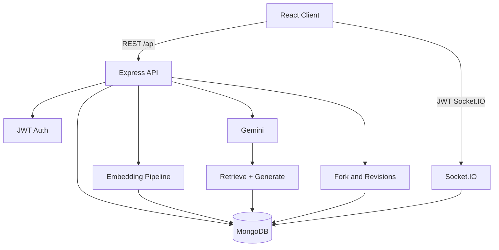

# Quilio

**A blog isn’t just something you read — it’s something you learn from, verify, remix, and grow from.**

Quilio is an AI-powered social learning and blogging platform: publish articles, discuss them, chat with grounded AI (RAG + citations), run quizzes, and **fork articles into your own learning notes** with version history.

## Stack

| Layer | Technology |
|-------|------------|
| Frontend | React, Vite, Tailwind, Zustand, Socket.IO client |
| Backend | Node.js, Express |
| Database | MongoDB (Mongoose) |
| Auth | JWT + bcrypt; Google Identity Services |
| AI | Google Gemini (embeddings + generation) |
| Media | Cloudinary |

## Features

- Auth (email/password, Google, production-gated demo login)
- Social blogging: feed, follow, like, comment, bookmark, search
- **Chat with a post** — per-article RAG with source snippets
- **Learn This** — concepts + quizzes
- Embedding pipeline (chunk → embed → store)
- **Fork + version history** — attribution lineage and restore
- Notifications (API + Socket.IO)

## Architecture



### AI chat flow

1. User asks a question on a post.  
2. Missing embeddings are generated for that post.  
3. Query embedding retrieves top chunks (cosine; optional Atlas Vector Search).  
4. Weak/empty retrieval → grounded refusal.  
5. Otherwise Gemini answers from those chunks only; sources are filtered to retrieved text.

### Fork lineage

```
Original post (root)
    └── Fork A (forkedFrom → original, rootPost → original)
            └── Fork B (forkedFrom → A, rootPost → original)
```

Edits create `PostRevision` snapshots; owners can **restore** a revision (current text is saved first).

## Quick start

```bash
# API
cd server
cp .env.example .env   # MONGODB_URI, JWT_SECRET, GEMINI_API_KEY, CLOUDINARY_*, CLIENT_URL
npm install
npm run dev

# Web
cd client
npm install
npm run dev
```

```bash
cd server && npm run seed   # optional demo content
```

## Scripts

| Command | Purpose |
|---------|---------|
| `cd server && npm test` | Automated tests |
| `cd server && npm run eval:rag` | Offline retrieval metrics (if present) |
| `cd client && npm run build` | Production frontend build |

## API highlights

| Method | Path | Description |
|--------|------|-------------|
| POST | `/api/posts/:id/fork` | Fork into your draft |
| GET | `/api/posts/:id/revisions` | List revisions (owner) |
| POST | `/api/posts/:id/revisions/:revisionId/restore` | Restore snapshot (owner) |
| POST | `/api/ai/chat/:postId` | RAG chat |

## Deployment

See `docs/DEPLOYMENT.md` if present. Typical split:

- **API:** Render/Railway (`server/`, `npm start`)
- **Web:** Vercel (`client/`, `dist`)

**Live demo:** not verified in this repository snapshot — add the URL after deploy.

## Known limitations

- Per-post retrieval by default (not full-corpus vector search unless Atlas is enabled)
- RAG quality depends on embedding coverage and chunking
- Full collaborative editing / CRDT is out of scope

## License

ISC
