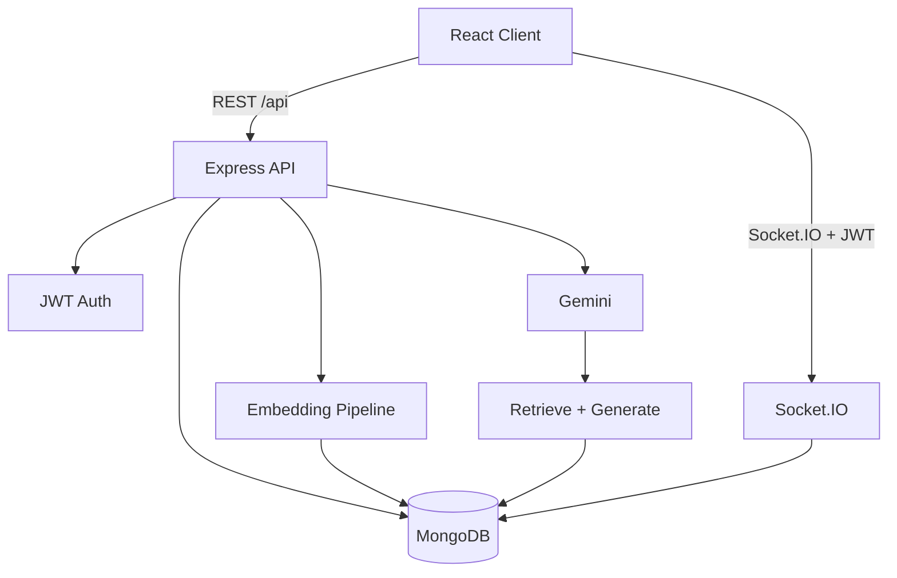

# Quilio

**A blog isn’t just something you read — it’s something you learn from, verify, remix, and grow from.**

AI-powered social learning and blogging platform: publish articles, discuss them, chat with grounded AI (RAG + citations), and turn posts into quizzes.

## Stack

| Layer | Technology |
|-------|------------|
| Frontend | React, Vite, Tailwind, Zustand, Socket.IO client |
| Backend | Node.js, Express |
| Database | MongoDB (Mongoose) |
| Auth | JWT + bcrypt; Google Identity Services |
| Media | Cloudinary |
| AI | Google Gemini (`text-embedding-004`, `gemini-2.0-flash`) |

## Features (implemented)

- Auth: register, login, Google sign-in, demo login (**disabled when `NODE_ENV=production`**)
- Posts, feed, follow, like, comment, bookmark, search
- **Chat with a post** — RAG over that article’s chunks with source snippets
- **Learn This** — concepts + quiz generation
- Embeddings pipeline with status tracking and retries
- Notifications API + Socket.IO delivery (JWT-authenticated rooms)
- Boot splash → welcome → login/register → home

## Architecture



### AI chat flow

1. User asks a question on a post.  
2. If no chunks exist, embedding job runs for that post.  
3. Query is embedded; top-K chunks with cosine ≥ `RAG_MIN_SCORE` are selected.  
4. If none pass the threshold → grounded refusal (no fabricated answer).  
5. Else Gemini answers using only those chunks; response includes source excerpts.

## Quick start

```bash
# Backend
cd server
cp .env.example .env   # set MONGODB_URI, JWT_SECRET, GEMINI_API_KEY, CLOUDINARY_*, CLIENT_URL
npm install
npm run dev

# Frontend
cd client
cp .env.example .env   # VITE_GOOGLE_CLIENT_ID if using Google sign-in
npm install
npm run dev
```

Seed demo users/posts:

```bash
cd server && npm run seed
# Demo (development only): aria@quilio.app / demo1234
```

## Scripts

| Command | Where | Purpose |
|---------|--------|---------|
| `npm run dev` | server / client | Local development |
| `npm test` | server | Unit + HTTP tests |
| `npm run eval:rag` | server | Offline retrieval metrics (BOW proxy dataset) |
| `npm run build` | client | Production frontend build |
| `npm run seed` | server | Seed demo content |

## Environment variables

See `server/.env.example` and `client/.env.example`.

Important server vars: `MONGODB_URI`, `JWT_SECRET`, `JWT_EXPIRE`, `CLIENT_URL`, `GEMINI_API_KEY`, `CLOUDINARY_*`, `GOOGLE_CLIENT_ID`, `RAG_MIN_SCORE` (optional, default `0.35`).

## Testing & CI

GitHub Actions (`.github/workflows/ci.yml`):

- Server: `npm test`
- Client: `npm run build`

## Vector retrieval note

Current production path scores **per-post** chunks in the API (cosine on stored Gemini vectors). This is appropriate for article-scoped chat. Corpus-scale search should use **MongoDB Atlas Vector Search** (index definition TBD when Atlas search is enabled on your cluster). Do not describe in-app cosine over full collections as Atlas Vector Search.

## Deployment (checklist)

1. Deploy API (Render/Railway/Fly) with production env vars; `NODE_ENV=production`.  
2. Deploy client (Vercel) with API base URL / proxy to the API.  
3. Set `CLIENT_URL` to the real frontend origin (CORS).  
4. Confirm `GET /api/health` → `database: connected`.  
5. Smoke: register → publish → chat → learn → notification.

**Live demo:** not verified in this repository snapshot (add URL when deployed).

## Known limitations

- No verified public deployment in-repo.  
- RAG eval in CI uses a small offline bag-of-words proxy, not live Gemini.  
- Atlas Vector Search index not required for per-post chat but needed for scalable semantic corpus search.  
- AI daily limits use MongoDB (`AIUsage`); falls back to memory if DB is down.

## License

ISC
